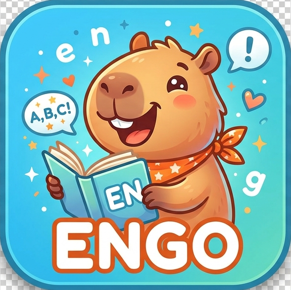

# 
 🌟 ENGO - DANH SÁCH TÍNH NĂNG NỀN TẢNG HỌC TIẾNG ANH 🌟

---

## 1. 🎓 PHÂN HỆ HỌC SINH (STUDENT PORTAL)

### 1.1. Quản lý tài khoản cá nhân
* **Đăng ký & Đăng nhập:** Đăng ký tài khoản theo khối lớp (Khối 6, 7, 8, 9) và đăng nhập nhanh chóng.
* **Tự xóa tài khoản (Self Delete):** Tự động xóa thông tin và tài khoản của mình khỏi hệ thống khi không còn nhu cầu sử dụng.

### 1.2. 🦫 Bạn đồng hành ảo Capybara & Gamification (Tính mới NCKH)
* **Linh vật Capybara tương tác:** Trợ lý ảo Capybara hiển thị ngay trên Dashboard với các cấp độ tiến hóa (Lv.1 Capybara Mầm Non $\rightarrow$ Lv.5 Capybara Bậc Thầy).
* **🥕 Kho Cà rốt tích lũy (Carrot Bank):** Nhận thưởng cà rốt khi hoàn thành bài tập, luyện phát âm đạt điểm cao, hoặc hoàn thành phiên tập trung Pomodoro.
* **Trò chuyện giọng nói cùng Capybara:** Bấm nút trò chuyện để Capybara chia sẻ lời khuyên học tập, nhắc nhở quy tắc ngữ pháp bằng giọng nói Audio (Text-to-Speech).
* **Nuôi & Nâng cấp Capybara:** Dùng 10 Cà rốt để "Cho Capybara ăn" đổi lấy +50 XP và tăng cấp độ đồng hành.

### 1.3. 🎙️ Phòng Luyện Nói & Phát Âm AI (AI Speaking Lab - Tính mới NCKH)
* **Kho mẫu câu phong phú:** Luyện phát âm theo 3 chủ đề trọng tâm:
  1. *Ngữ pháp Thì Hiện tại đơn & Quá khứ đơn (Grammar Focus)*
  2. *Giao tiếp đời sống & Trường học (Daily Communication)*
  3. *Chủ đề bài học Global Success 9 (Unit 1 & Unit 2)*
* **🔊 Phát âm bản xứ chuẩn quốc tế:** Tích hợp Audio Text-to-Speech phát âm chuẩn giọng US/UK kèm phiên âm quốc tế IPA và nghĩa tiếng Việt.
* **🎙️ Nhận diện giọng nói AI (Web Speech API):** Thu âm trực tiếp qua micro với hiệu ứng sóng âm động và chuyển đổi giọng nói thành văn bản theo thời gian thực.
* **Bộ chấm điểm AI chuẩn xác (% Accuracy):** So khớp từng từ và tính điểm phần trăm phát âm chuẩn xác.
* **Phân tích từng từ (Word-by-word Breakdown):** Đánh dấu màu xanh lá cho từ đọc chuẩn, màu đỏ/gạch chân cho từ đọc chưa rõ hoặc bị thiếu.
* **Đồng hành & Thưởng điểm:** Gia sư Capybara đưa ra nhận xét động viên tức thì và thưởng Cà rốt + XP khi đạt điểm xuất sắc ($\ge 90\%$).

### 1.4. Ôn luyện ngữ pháp tương tác & AI Mentor
* **Chuyên đề ngữ pháp trọng tâm:** Luyện tập các thì cơ bản và nâng cao trong chương trình THCS (Present Simple, Past Simple, Present Continuous, Comparatives...).
* **Đa dạng dạng bài:** Bài tập trắc nghiệm 4 lựa chọn (A, B, C, D), bài tập chia thì động từ và điền khuyết.
* **Giải thích chi tiết chuẩn AI:** Phân tích 3 bước: Quy tắc ngữ pháp $\rightarrow$ Dấu hiệu nhận biết $\rightarrow$ Lời khuyên chống bẫy từ Capybara.

### 1.5. 🛡️ Làm bài kiểm tra trực tuyến có Giám sát An toàn (Smart Anti-Cheat Guard - Tính mới NCKH)
* **Nhận bài từ Giáo viên:** Làm các bài kiểm tra 15 phút, 1 tiết hoặc bài ôn tập do giáo viên bộ môn giao.
* **Đồng hồ đếm ngược:** Hiển thị thời gian làm bài thực tế, tự động khóa và nộp bài khi hết giờ.
* **Tự động lưu tạm thời:** Lưu trữ trạng thái câu trả lời trong quá trình làm bài để tránh mất dữ liệu khi gián đoạn mạng.
* **🛡️ Phát hiện chuyển Tab & Rời màn hình:** Cảnh báo đỏ lập tức khi học sinh chuyển tab sang tra Google/ChatGPT và ghi nhận số lần vi phạm vào báo cáo gửi giáo viên.
* **⛔ Chống sao chép (Anti-Copy):** Khóa chức năng copy câu hỏi và khóa chuột phải trong phòng thi.
* **🔀 Đổi mã đề / Xáo trộn ngẫu nhiên:** Xáo trộn thứ tự câu hỏi và phương án A-B-C-D ngẫu nhiên để chống nhìn bài.

### 1.6. Theo dõi tiến độ & Bảng điểm
* **Chấm điểm tự động:** Nhận điểm số ngay lập tức (thang điểm 10) sau khi nhấn nộp bài.
* **Lịch sử học tập cá nhân:** Xem lại toàn bộ danh sách các bài kiểm tra đã làm, điểm số đạt được và nhận xét chi tiết từ giáo viên.
* **Bản đồ năng lực Radar 6 kỹ năng:** Đánh giá độ thành thạo Nghe, Nói, Đọc, Viết, Ngữ pháp, Từ vựng theo thời gian thực.

---

## 2. 👩‍🏫 PHÂN HỆ GIÁO VIÊN (TEACHER HUB)

### 2.1. Tạo bài kiểm tra thông minh
* **Tạo đề tự động từ file Word (.docx):** Tải trực tiếp file đề thi DOCX có sẵn từ máy tính, hệ thống tự động bóc tách tiêu đề, danh sách câu hỏi, các phương án A-B-C-D và đáp án chuẩn chỉ trong vài giây.
* **Tạo đề thủ công:** Tự do đặt tên bài kiểm tra, cấu hình thời gian làm bài (phút), hạn chót nộp bài và soạn câu hỏi trực tiếp trên form.
* **Tùy biến câu hỏi:** Xem trước, chỉnh sửa nội dung, thay đổi thứ tự hoặc xóa bớt câu hỏi trước khi xuất bản đề.

### 2.2. Quản lý ngân hàng đề thi
* **Danh sách đề thi:** Theo dõi toàn bộ các bài kiểm tra đã tạo, trạng thái mở/đóng và thời gian tạo.
* **Xóa đề thi:** Hỗ trợ nút `🗑️ Xóa` để xóa nhanh các bài kiểm tra cũ hoặc bài thi thử nghiệm.

### 2.3. Chấm điểm & Quản lý bài nộp của học sinh
* **Chấm trắc nghiệm tự động 100%:** Hệ thống tự động so khớp đáp án và tính điểm cho học sinh.
* **Chấm bài tự luận (Writing):** Giao diện riêng cho phép giáo viên đọc bài viết, chấm điểm và gửi nhận xét, sửa lỗi ngữ pháp cho từng học sinh.
* **Xóa bài nộp lỗi:** Xóa bài nộp không hợp lệ hoặc cho phép học sinh làm lại khi cần thiết.

### 2.4. Thống kê & Phân tích kết quả học tập (Learning Analytics)
* **Bảng điểm tổng hợp:** Xem bảng điểm đầy đủ của toàn bộ học sinh trong lớp theo từng bài kiểm tra.
* **Chỉ số phân tích:** Thống kê điểm trung bình, điểm cao nhất, điểm thấp nhất và tỷ lệ hoàn thành bài tập.
* **Phân loại năng lực:** Hỗ trợ phát hiện học sinh còn yếu ở các chuyên đề ngữ pháp cụ thể để kịp thời phụ đạo.

---

## 3. 🛡️ PHÂN HỆ QUẢN TRỊ VIÊN (ADMIN PORTAL)

* **Quản lý người dùng toàn hệ thống:** Xem danh sách toàn bộ tài khoản giáo viên và học sinh trong trường.
* **Phân quyền người dùng (RBAC):** Phân định rạch ròi 3 cấp độ quyền hạn: `Admin`, `Teacher`, `Student`.
* **Tạo & Xóa tài khoản:** Cấp tài khoản mới cho giáo viên hoặc xóa tài khoản học sinh khi ra trường.

---

## 4. ⚙️ TÍNH NĂNG KỸ THUẬT & BẢO MẬT HỆ THỐNG

* **AI Web Speech Recognition & Synthesis:** Ứng dụng công nghệ xử lý giọng nói HTML5 trực tiếp trên trình duyệt, không tốn phí bản quyền API.
* **Bảo mật xác thực JWT:** Sử dụng JSON Web Token lưu trữ trong `HttpOnly Cookie` chống tấn công XSS.
* **Mã hóa mật khẩu an toàn:** Toàn bộ mật khẩu người dùng được băm (hash) bằng thuật toán `Bcrypt`.
* **Bộ bóc tách DOCX chuyên dụng:** Module bóc tách định dạng văn bản Word sử dụng regex thông minh, nhận diện chính xác cấu trúc đề thi trắc nghiệm tiếng Anh.
* **Tự động cấu hình CSDL:** Tự động tạo bảng dữ liệu và thiết lập quan hệ (Schema Auto-setup) khi khởi chạy server.
* **Giao diện hiện đại (Responsive SPA):** Tương thích hoàn hảo trên máy tính phòng máy, laptop, máy tính bảng và điện thoại di động.
